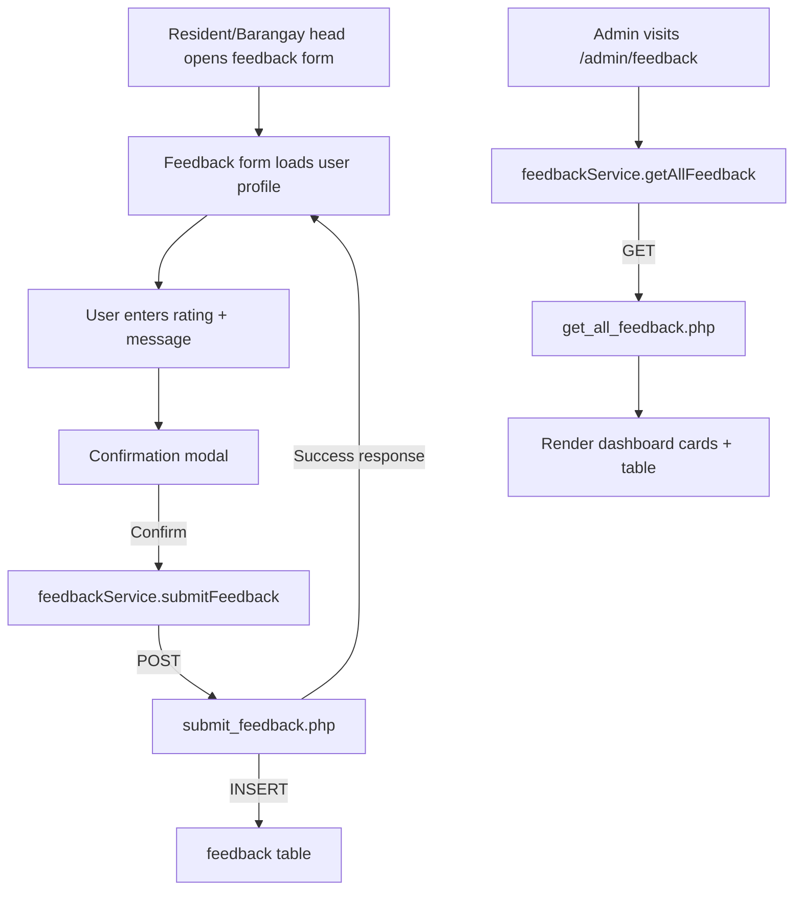

# Feedback Module

## Overview
The Feedback module captures satisfaction ratings and comments from residents and barangay heads, then presents aggregated insights to administrators. It powers continuous improvement by tracking service sentiment across barangays.

- **Resident submission UI:** `src/components/resident/Feedback.jsx`
- **Barangay head submission UI:** `src/components/barangayhead/Feedback.jsx`
- **Admin review UI:** `src/components/admin/Feedback.jsx`
- **Routes:**
  - `/resident/feedback` (RequireAuth `resident`)
  - `/barangayhead/feedback` (RequireAuth `barangay_head`)
  - `/admin/feedback` (RequireAuth `admin`)
- **Service layer:** `src/services/feedbackService.js`
- **Primary APIs:**
  - `backend/api/submit_feedback.php`
  - `backend/api/get_all_feedback.php`
- **Database table:** `feedback`

## Core Features
- Star-based rating (1–5) with contextual descriptions to guide the user
- Text feedback field with confirmation modal before final submission
- Automatic pre-fill of user name and barangay based on profile
- Admin dashboard stats: total submissions, average rating, positive/neutral/negative counts
- Filter/search by category, rating, and text
- Detailed modal for each feedback entry with rating breakdown and resident info

## Core Code Highlights
- `fetchUserDetails` effect – merges local storage account info with `/get_user_details.php` and optional barangay lookup before enabling the form.
- `handleSubmit` – validates rating/message/profile completeness, constructs payload, and triggers confirmation modal.
- `handleConfirmSubmit` – calls `feedbackService.submitFeedback` (→ `/backend/api/submit_feedback.php`), handles success/error, and resets UI state.
- `feedbackService.getAllFeedback` – admin data loader with defensive JSON parsing and error logging for the table view.
- Admin `Feedback.jsx` – memoizes filters, aggregates ratings into summary cards, and renders detail modal via `selectedFeedback` state.

## Data Flow

## Validation & Error Handling
- Client-side checks ensure rating, message, barangay, and full name exist before submit
- Backend validates JSON, required fields, and dynamically maps column names (tolerant to schema variations)
- Errors surface via inline alerts in frontend and HTTP 400 responses in backend

## Extending the Module
- Add category-specific forms (e.g., service type, route feedback) by changing `feedback_type`
- Integrate notification system (email/SMS) for low rating alerts
- Export/print capability for admin feedback table (similar to Issues printable feature)
- Graph analytics (e.g., trend lines) using aggregated API endpoints

## Quick Test Checklist
1. Ensure user profile has barangay/name in `user_profile` table.
2. As resident, go to `/resident/feedback`, submit rating + text.
3. Observe confirmation prompt and success modal; check `feedback` table row.
4. As barangay head, repeat to confirm role coverage.
5. Admin loads `/admin/feedback`; new entries appear in table and stats update.
6. Filter by rating/category and open feedback detail modal to confirm data integrity.
