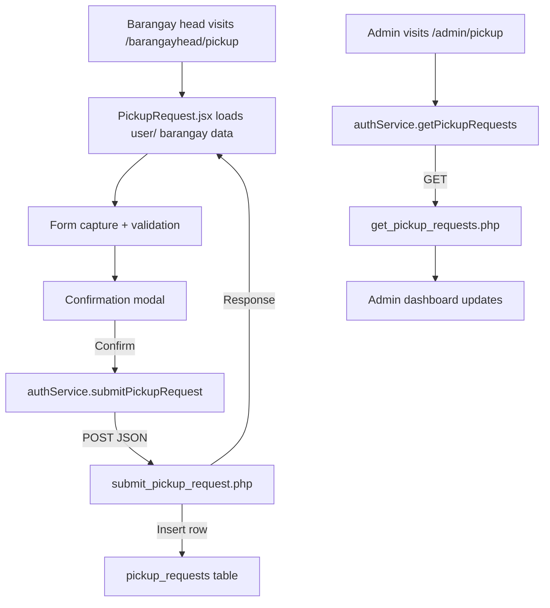

# Special Pickup Requests Module

## Overview
The Special Pickup Requests module lets barangay heads (and other authorised roles) schedule ad-hoc garbage pickups that fall outside regular routes. It captures contact details, preferred pickup date, and waste type, then exposes the requests to admin staff for triage.

- **Barangay head submission UI:** `src/components/barangayhead/PickupRequest.jsx`
- **Admin management UI:** `src/components/admin/Pickup.jsx` / `PickupSimple.jsx`
- **Routes:**
  - `/barangayhead/pickup` (protected by `RequireAuth` with `barangay_head` role)
  - `/admin/pickup` (protected by `RequireAuth` with `admin` role)
- **Service hooks:** `authService.submitPickupRequest`, `authService.getPickupRequests`, `authService.updatePickupRequestStatus`
- **Primary APIs:**
  - `backend/api/submit_pickup_request.php`
  - `backend/api/get_pickup_requests.php`
  - `backend/api/update_pickup_request_status.php`
- **Database table:** `pickup_requests`

## Core Features
- Auto-fills barangay head info (name, barangay, contact) via `authService.getUserData`
- Validates contact number (`09XXXXXXXXX`) and future pickup dates before submission
- Confirmation modal prior to sending request; success modal on completion
- Admin dashboard summarises requests, allows status transitions (pending → approved/scheduled → completed)
- Optional notes field for special handling instructions

## Core Code Highlights
- `useEffect(fetchUserData)` – hydrates requester details from localStorage + `/get_user_details.php`, then infers barangay head metadata.
- `handleSubmit` – performs front-end validation, prepares payload, and triggers confirmation modal.
- `confirmSubmission` – posts payload via `authService.submitPickupRequest` (→ `/backend/api/submit_pickup_request.php`) and handles optimistic reset.
- `authService.getPickupRequests` & `updatePickupRequestStatus` – admin-side calls that power the pickup management UI.
- Backend `submit_pickup_request.php` – enforces date/phone validation, auto-fills missing barangay via joins, and writes to `pickup_requests` table.

## Submission Flow

## Admin Processing
- Admin UI polls or refreshes to fetch pending requests
- Status updates trigger `update_pickup_request_status.php` with payload `{ request_id, status, ... }`
- Optional hooks exist for assigning drivers or adding schedule metadata (extend payload + table columns)

## Extending the Module
- Add email/SMS notifications when request status changes
- Attach uploaded documents or photos for specialized waste (extend frontend + backend to handle multipart payloads)
- Implement calendar view for approved pickups (sync with existing schedule module)

## Quick Test Checklist
1. Login as barangay head; open `/barangayhead/pickup` and verify fields auto-populate.
2. Submit with invalid contact number (expect validation warning).
3. Submit with valid data; ensure success modal appears.
4. As admin, open `/admin/pickup` and confirm new request appears with `pending` status.
5. Change status (e.g., to `approved`); verify backend response and UI refresh.
6. Inspect `pickup_requests` table to confirm entries and status updates.
